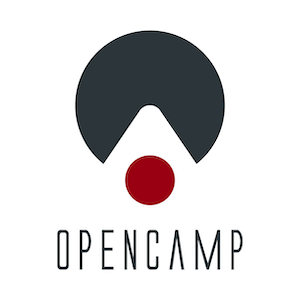

# OpenCamp

   
 

## Table of Contents

-   [Stack Technique](#stack-technique)
-   [License](#license)

## Stack Technique

### Stack validé
-   **Global**
    -   Typescript
    -   git-flow

-   **Front**
    -   No CSS Framework

-   **Back**
    -   nodeJS
    -   Express
    -   Postgresql + Sequelize

-   **Test**
    -   Mocha
    -   Chai
    -   Istanbul
  
### Stack provisoire 
-   **Front** : 
    -   Vuejs / Svelte
    -   NuxtJS

## License

The content of this repository is bound by the following licenses :

-   The computer software is licensed under the [GPL-3.0 license](https://github.com/Open-Camp/OpenCamp/blob/master/LICENSE).
-   The learning resources in the /cursus directory including their subdirectories thereon are licensed under the [CC-BY-SA-4.0 license](https://creativecommons.org/licenses/by-sa/4.0/).

